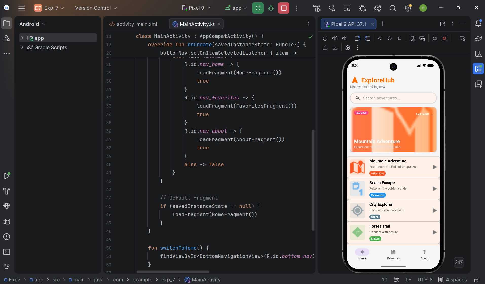
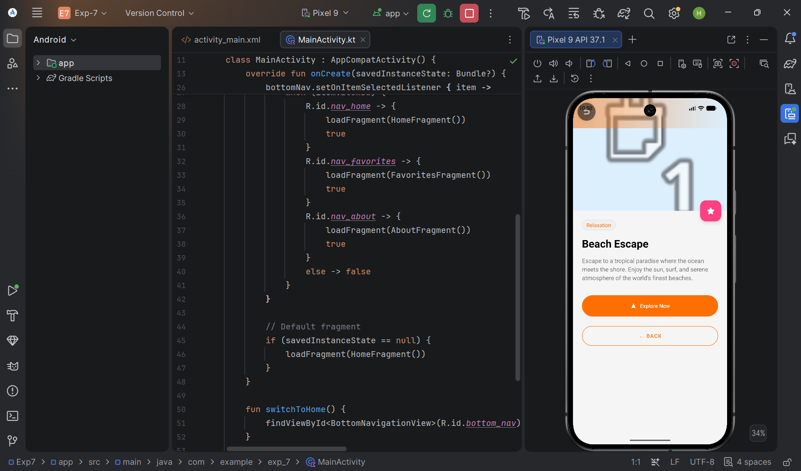
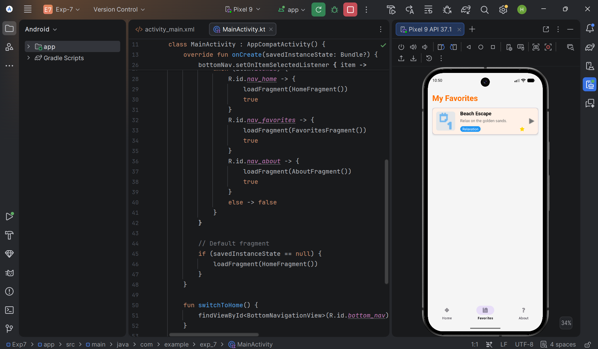

# ExploreHub - Discovery Adventure App

ExploreHub is a professional, interactive, and adaptive Android application designed to showcase a modern discovery experience. The app allows users to browse various adventures, search for specific topics, manage a favorites list, and view detailed information about each destination.

## 🚀 Key Features

- **Dynamic Home Dashboard**: Features a vibrant banner, a real-time search bar, and a featured adventure section.
- **Interactive ListView**: A card-based list of adventures with category tags, descriptions, and favorite indicators.
- **Rich Detail Screen**: Showcases large imagery, detailed descriptions, and interactive "Explore" and "Favorite" actions.
- **Navigation System**: A standard Material 3 Bottom Navigation bar for seamless switching between Home, Favorites, and About sections.
- **Adaptive Design**: Fully responsive layout that adjusts perfectly to different screen sizes and orientations.

## 🛠️ Code System Structure

The application follows a **Single Activity Multiple Fragments** architecture for the main shell, with a dedicated activity for detailed content.

### Java/Kotlin Sources (`app/src/main/java/com/example/exp_7/`)

- **`MainActivity.kt`**: The shell activity that manages the `BottomNavigationView` and fragment transactions.
- **`DetailActivity.kt`**: Displays comprehensive details for a selected adventure, including favorite toggling and back navigation.
- **`HomeFragment.kt`**: Manages the main dashboard, featured card, and search-enabled adventure list.
- **`FavoritesFragment.kt`**: Displays a filtered list of adventures marked as favorites by the user.
- **`AboutFragment.kt`**: Provides information about the app and the technologies used in its development.
- **`ExploreAdapter.kt`**: A custom `ArrayAdapter` that powers the interactive `ListView` with themed cards and state indicators.
- **`ExploreRepository.kt`**: A singleton repository that acts as the single source of truth for adventure data and favorite states.
- **`ExploreItem.kt`**: The core data model representing an adventure destination.

### Resource Layouts (`app/src/main/res/layout/`)

- **`activity_main.xml`**: Main container with `BottomNavigationView` and a `FragmentContainerView`.
- **`activity_detail.xml`**: A rich layout using `CollapsingToolbarLayout` and `NestedScrollView`.
- **`fragment_home.xml`**: Dashboard layout with `CoordinatorLayout`, `SearchView`, and the main `ListView`.
- **`fragment_favorites.xml`**: A list-based layout with an integrated empty-state view.
- **`fragment_about.xml`**: A clean informational layout with brand assets.
- **`list_item_explore.xml`**: The custom card design used for every adventure row in the app.

## 📸 Output Gallery

The following screenshots demonstrate the ExploreHub user interface:

|  |  |

|  |  |

---
*Developed as a demonstration of professional Android UI/UX practices using ListView and ImageView.*
